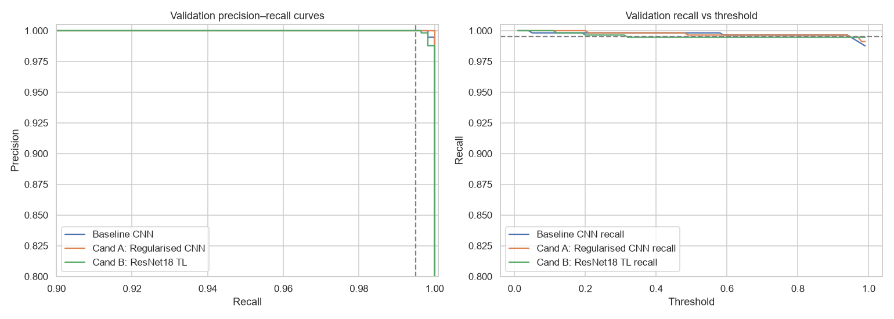
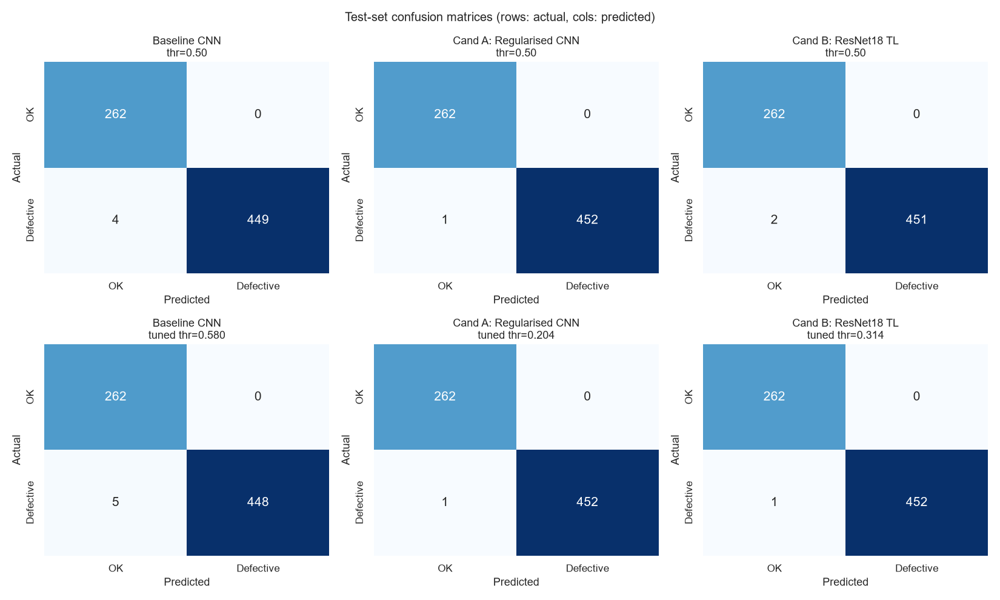
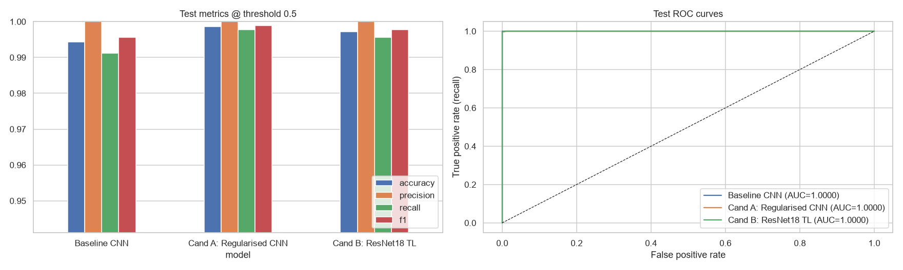
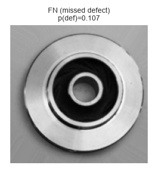
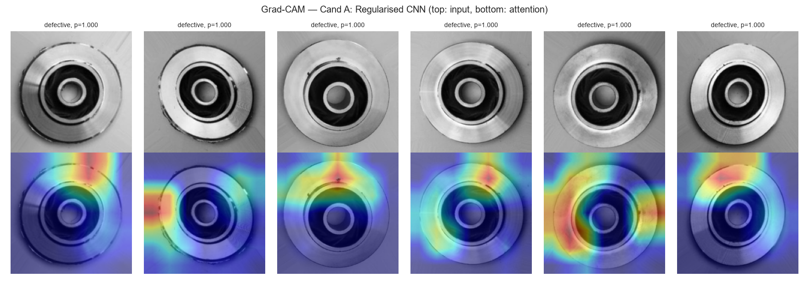

# Automated Visual Defect Detection with CNNs — Model Comparison Report

**Project:** Casting product defect detection (submersible-pump impellers)
**Notebook:** [defect_detection_pytorch.ipynb](defect_detection_pytorch.ipynb). All figures below come from this notebook's run and are saved in [results.json](results.json).
**Hardware:** NVIDIA GeForce RTX 4050 Laptop GPU, PyTorch 2.11 (CUDA 12.8)
**Date:** 2026-09-26

---

## 1. Executive summary

- **Goal:** classify top-down impeller images as *OK* or *Defective*, minimising **missed defects** (false negatives) while keeping false alarms low.
- **Models compared:** three, all using the same data, loss, early-stopping rule and evaluation code:
  1. Baseline CNN from scratch
  2. **Candidate A:** a regularised CNN from scratch
  3. **Candidate B:** ResNet18 transfer learning
- **Selected model: Candidate A.** On the 715-image test set it misses **1 of 453 defects** (recall 99.78 %) and raises **0 false alarms** (precision 100 %).
- **Improvement over the baseline:** missed defects drop from **4 → 1** (−75 %) at the default threshold. The baseline was already very strong, though. The absolute gain is **3 images**, so treat it as a meaningful but small improvement, not a step-change.

---

## 2. Data

| Split | Images | OK | Defective | Defective share |
|---|---|---|---|---|
| Train | 5,638 | — | — | 56.7 % |
| Validation (15 % of official train, stratified) | 995 | 431 | 564 | 56.7 % |
| Test (official, untouched until final evaluation) | 715 | 262 | 453 | 63.4 % |

- **Source:** the Kaggle *casting_data* version, 7,348 images at 300×300. Images are loaded as single-channel grayscale because colour carries no information.
- **Validation set:** used for early stopping, model selection and threshold tuning. The test set is only used once, for the final numbers.
- **Normalisation:** statistics come from the training split only (mean 0.564, std 0.237) to avoid leakage.
- **Class balance:** mildly imbalanced, so precision, recall and F1 are reported alongside accuracy.

---

## 3. Phase 1 — Baseline CNN

**Architecture (1.29 M params):**
- Input: 128×128 grayscale
- 4 × [Conv3×3 → ReLU → MaxPool] with 32→64→128→128 filters
- Head: Flatten → Dense(128) → Dropout(0.5) → Dense(1)
- No batch-norm and no augmentation

**Training:** AdamW with lr 1e-3, a one-cycle schedule and BCE-with-logits loss. It ran for up to 20 epochs with early stopping on validation loss. Training ran all 20 epochs in 62 s, and the best validation loss was 0.0045.

**Test results (threshold 0.5):** accuracy 0.9944, precision 1.0000, recall 0.9912, F1 0.9956, with **4 missed defects and 0 false alarms**.

**Diagnosis:**
- **Resolution:** at 128×128, small pinholes and blow-holes shrink to a few pixels. This is the main limitation of the baseline.
- **Operating point:** a 0.5 threshold is arbitrary when a missed defect costs far more than a false alarm.
- **Over-fitting (correction):** the notebook's markdown says the baseline over-fits. The training log does **not** support this: validation loss kept falling to 0.0045 alongside training loss. The baseline was capacity- and resolution-limited rather than over-fitting.

---

## 4. Phase 2 — Improving on the baseline

### Options considered

| Option | Decision | Reason |
|---|---|---|
| **A. Regularised scratch CNN** (224 px, BatchNorm, GAP head, weight decay, augmentation) | **Tried** | Small and fast, needs no external weights, and isolates the effect of resolution plus regularisation |
| **B. ResNet18 transfer learning** (ImageNet, full fine-tune) | **Tried** | Pre-trained edge/texture filters transfer well to surface defects, and it's still light enough for edge inference |
| Bigger backbones (ResNet50, EfficientNet, ViT) | Rejected | 2–8× slower, with little headroom left on this dataset |
| Class re-weighting / oversampling | Rejected | Imbalance is mild and favours the positive class. Threshold tuning handles the cost trade-off more transparently |
| Anomaly detection (train on OK only) | Rejected | Plenty of labelled defects are available, and supervised learning is stronger here |

### Candidate A — Regularised CNN (2.35 M params)

- **Architecture:** 224×224 input, then 5 × [Conv–BN–ReLU–Conv–BN–ReLU–MaxPool] with 32→64→128→256→256 filters. The head is GlobalAvgPool → Dropout(0.3) → Linear(1).
- **Training:** AdamW with lr 2e-3 and weight decay 1e-4, up to 25 epochs, patience 7.
- **Augmentation (on GPU):**
  - 90° rotations and flips (the impeller is rotationally symmetric, so these preserve the label)
  - ±15° rotation, ±10 % zoom and ±5 % shift
  - ±15 % brightness/contrast jitter to simulate lighting drift
- **Outcome:** trained all 25 epochs in 570 s, with a best validation loss of 0.0034.
- **Instability:** validation loss spiked in epochs 2 and 8 (to 0.69 and 1.25). This is likely due to the high learning rate combined with BatchNorm early in the one-cycle warm-up. Early stopping on the best checkpoint absorbed it, but a lower peak learning rate would make training more robust.

### Candidate B — ResNet18 transfer learning (11.18 M params)

- **Architecture:** ImageNet weights, with grayscale replicated to 3 channels and ImageNet normalisation. The head is replaced by Dropout(0.3) → Linear(1).
- **Discriminative learning rates:** 3e-4 for the backbone and 3e-3 for the head, with the same augmentation as A.
- **Outcome:** early-stopped after 11 epochs in 149 s, with a best validation loss of 0.0067.
- **Convergence:** it reached 99.1 % validation accuracy after one epoch, which shows how quickly pre-trained features transfer.

---

## 5. Model selection and threshold tuning (validation set only)

**Validation @ threshold 0.5:**

| Model | Accuracy | Recall | F1 | ROC-AUC | FN | FP |
|---|---|---|---|---|---|---|
| Baseline CNN | 0.9990 | 0.9982 | 0.9991 | 0.99999 | 1 | 0 |
| Cand A: Regularised CNN | 0.9980 | 0.9965 | 0.9982 | **1.00000** | 2 | 0 |
| Cand B: ResNet18 TL | 0.9970 | 0.9947 | 0.9973 | 0.99997 | 3 | 0 |

**Selection rule:** highest validation ROC-AUC, with F1 as the tie-break. **Candidate A** won. Be clear about how thin this margin is: the three models are effectively tied on validation, and the baseline actually has the best validation F1. The selection hinges on a 10⁻⁵ difference in AUC.

**Threshold rule:** pick the threshold with the highest precision that still keeps validation recall ≥ **99.5 %**.

| Model | Tuned threshold |
|---|---|
| Baseline CNN | 0.580 |
| Cand A | 0.204 |
| Cand B | 0.314 |

---

## 6. Test-set results (715 images, 453 defective)

| Model | Threshold | Accuracy | Precision | Recall | F1 | ROC-AUC | FN | FP |
|---|---|---|---|---|---|---|---|---|
| Baseline CNN | 0.50 | 0.9944 | 1.0000 | 0.9912 | 0.9956 | 1.0000 | 4 | 0 |
| Baseline CNN | tuned 0.580 | 0.9930 | 1.0000 | 0.9890 | 0.9945 | 1.0000 | 5 | 0 |
| **Cand A: Regularised CNN** | 0.50 | 0.9986 | 1.0000 | 0.9978 | 0.9989 | 0.99998 | **1** | **0** |
| **Cand A: Regularised CNN** | tuned 0.204 | 0.9986 | 1.0000 | 0.9978 | 0.9989 | 0.99998 | **1** | **0** |
| Cand B: ResNet18 TL | 0.50 | 0.9972 | 1.0000 | 0.9956 | 0.9978 | 0.99999 | 2 | 0 |
| Cand B: ResNet18 TL | tuned 0.314 | 0.9986 | 1.0000 | 0.9978 | 0.9989 | 0.99999 | 1 | 0 |

**Candidate A vs baseline (threshold 0.5):**

| Metric | Baseline | Cand A | Δ |
|---|---|---|---|
| Accuracy | 0.9944 | 0.9986 | +0.42 pp |
| Precision | 1.0000 | 1.0000 | 0 |
| Recall | 0.9912 | 0.9978 | +0.66 pp |
| F1 | 0.9956 | 0.9989 | +0.33 pp |
| Missed defects | 4 | 1 | −3 (−75 %) |

**Observations:**
- **No false alarms:** no model produces a single false positive on test, so precision was never the constraint. Every remaining error is a missed defect.
- **Tuning can backfire:** the baseline's tuned threshold (0.58) *raised* its misses from 4 to 5. A threshold tuned on ~564 validation defects is noisy and doesn't always transfer.
- **Ranking is near-perfect:** test ROC-AUC is ≥ 0.99998 for all models. They rank almost perfectly, so the remaining errors are about where the threshold sits more than what the models have learned.
- **A vs B is a tie:** at their tuned thresholds, Candidates A and B tie exactly (1 FN, 0 FP). A wins at 0.5 and is ~5× smaller.

---

## 7. Deployment considerations

### Latency (batch of 1)

| Model | Params | CPU ms/image | GPU ms/image |
|---|---|---|---|
| Baseline CNN | 1.29 M | 3.5 | 2.3 |
| Cand A | 2.35 M | 21.6 | 4.4 |
| Cand B | 11.18 M | 19.4 | 4.6 |

- **Real-time:** all three run in under 25 ms per image on CPU, which is comfortably real-time for a production line (> 40 parts/s).
- **Why A is slower on CPU:** Candidate A is slower on CPU than ResNet18 despite having ~5× fewer parameters. It runs double convolutions at full 224 px resolution in its early blocks, while ResNet18's stem downsamples 4× straight away. So compute (FLOPs) matters more than parameter count here.

### Error analysis

At its tuned threshold, the selected model makes **one error: a missed defect with p(defective) = 0.107**. The defect isn't visually obvious at 224 px, which points to a very subtle defect or possibly a labelling issue. It's worth a manual look at full resolution.

### Grad-CAM (explainability)

- **Mostly the right place:** on correctly caught defects, attention mostly falls on the outer rim and edge chips, where the visible defects are. That's evidence the model uses the defect rather than background artefacts.
- **One diffuse case:** one example (5th from left) shows diffuse attention across the part, which warrants monitoring.
- **Missing code:** the Grad-CAM *code* is no longer in the notebook. Only the section heading remains, and `gradcam.png` comes from an earlier run. Restore the cell before resubmitting so the figure is reproducible.

### Recommended production setup

- **Deploy:** Candidate A at the validation-tuned threshold of **0.204**. Optionally, send parts in a 0.05–0.5 "uncertain" band to manual review, because the only miss scored 0.107.
- **Log:** every prediction, and track recall on audited samples plus the false-alarm rate by shift and line.
- **Retrain:** when lighting, camera or defect types change. Re-validate on **fresh line images**, not just this dataset.

---

## 8. Key lessons and reflection

1. **Build a strong baseline first:**
   - A 1.3 M-parameter CNN already reaches 99.1 % recall, which set a high bar.
   - Most of the later gain came from **resolution (128 → 224) plus augmentation**, not from a fancier architecture.
2. **Check the diagnosis against the logs:** the expected "over-fitting" story didn't match the training curves. The real limitation was input resolution.
3. **Transfer learning converges fastest:** ResNet18 reached > 99 % validation accuracy in one epoch. But a well-regularised scratch model matched it on this narrow, consistent domain at a fraction of the size.
4. **The threshold is a business decision:**
   - Choosing it on validation for a recall target makes the FN/FP trade-off explicit.
   - With very few positives near the boundary, the tuned threshold is noisy, as the baseline showed by getting worse after tuning.
5. **Differences are within noise:** 1 error is 0.22 pp of test recall. Honest reporting means saying that A, B and even the baseline are close, and justifying the choice on size, simplicity and speed as much as on the metric.

---

## 9. Limitations

- **Small test set:** 453 defective images is too few to separate models at > 99.5 % recall with statistical confidence. Repeated runs with different seeds, or cross-validation, would firm this up.
- **Possible near-duplicates:** the `casting_data` images were augmented by the dataset author, so near-duplicates may exist across the train and test splits. That inflates scores, and real production data will likely be harder.
- **Single run:** results come from one training run (seed 42). GPU nondeterminism means a re-run can shift individual errors.

---

## References

- Dataset: <https://www.kaggle.com/datasets/ravirajsingh45/real-life-industrial-dataset-of-casting-product>
- ResNet: He et al., 2015 — <https://arxiv.org/abs/1512.03385>
- Grad-CAM: Selvaraju et al., 2017 — <https://arxiv.org/abs/1610.02391>
